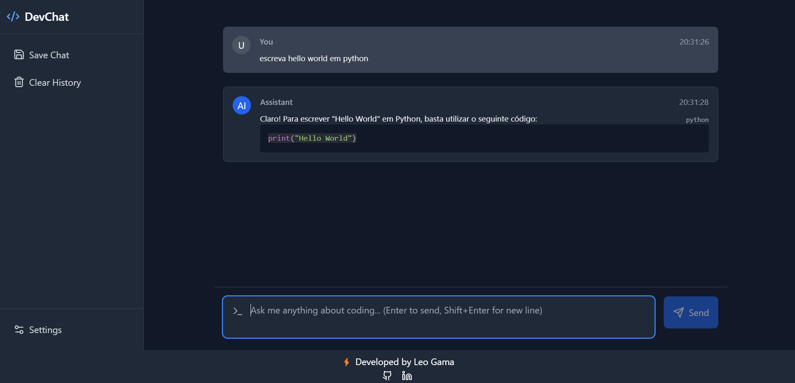
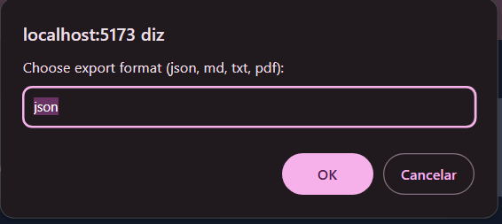
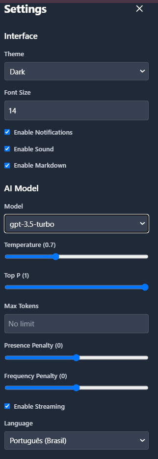

# WebChat with OpenAi

DevChat is a modern, AI-powered code assistant that helps developers with coding tasks, debugging, and technical discussions. Built with React and TypeScript, it provides a sleek, user-friendly interface for interacting with various Large Language Models.

## 🚀 Features

- 💬 Real-time chat interface with AI
- 🎨 Beautiful, responsive UI with dark/light mode
- 🔧 Multiple LLM model support
- 💾 Chat history export (JSON, MD, TXT, PDF)
- ⚡ Fast and efficient code highlighting
- ⚙️ Customizable settings
- 🔄 Markdown support for better formatting

## 🛠️ Technologies Used

- **Frontend:**
  - React 18
  - TypeScript
  - TailwindCSS
  - Lucide Icons
  - Framer Motion
  - React Hot Toast

- **Backend:**
  - Node.js
  - Express
  - OpenAI API

- **Development Tools:**
  - Vite
  - ESLint
  - PostCSS
  - npm

## 🤖 Supported AI Models

- GPT-4o
- GPT-4o-mini
- GPT-4
- GPT-4-Turbo
- GPT-3.5 Turbo
- o1-preview
- o1-mini

## 🚀 Getting Started

1. **Clone the repository**

2. **Install dependencies**
   \`\`\`bash
   # Install frontend dependencies
   npm install

   # Install server dependencies
   cd server
   npm install
   \`\`\`

3. **Configure environment variables**
   Create a \`.env\` file in the server directory:
   \`\`\`env
   OPENAI_API_KEY=your_api_key_here
   PORT=3000
   \`\`\`

4. **Start the development server**
   \`\`\`bash
   # Start the backend server
   cd server
   npm run dev

   # In another terminal, start the frontend
   cd ..
   npm run dev
   \`\`\`

5. **Open the application**
   Navigate to \`http://localhost:5173\` in your browser

## 💡 Usage

1. **Chat Interface:**
   - Type your message in the input field
   - Press Enter to send (Shift+Enter for new line)
   - Code blocks are automatically highlighted

2. **Settings:**
   - Click the settings icon to open the settings panel
   - Customize theme, font size, and AI model
   - Toggle markdown support and notifications

3. **Export Conversations:**
   - Click the "Save Chat" button
   - Choose your preferred format (JSON, MD, TXT, PDF)
   - Files are automatically downloaded
  

## ⚙️ Configuration Options

- **Font Size:** Adjustable text size
- **AI Model:** Selection of available LLMs
- **Temperature:** Adjust response creativity (0.0 - 1.0)
- **Max Tokens:** Control response length
- **Language:** Set preferred response language

  

## 🔒 Security

- API keys are stored securely in environment variables
- CORS is configured for secure client-server communication
- All external requests are validated and sanitized

## 🤝 Contributing

Contributions are welcome! Please feel free to submit a Pull Request.

1. Fork the repository
2. Create your feature branch (\`git checkout -b feature/AmazingFeature\`)
3. Commit your changes (\`git commit -m 'Add some AmazingFeature'\`)
4. Push to the branch (\`git push origin feature/AmazingFeature\`)
5. Open a Pull Request

## 📝 License

This project is licensed under the MIT License 

## 👤 Author

Leo Gama
- GitHub: [@LeoGamaJ](https://github.com/LeoGamaJ)
- Email: leo@leogama.cloud 
- LinkedIn: (https://www.linkedin.com/in/leonardo-gama-jardim/)
