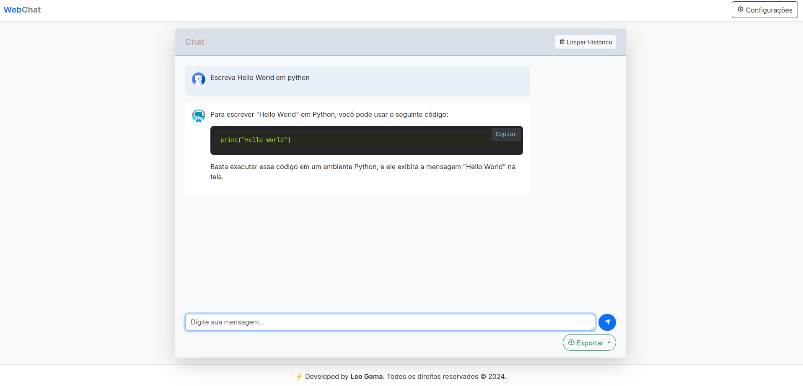
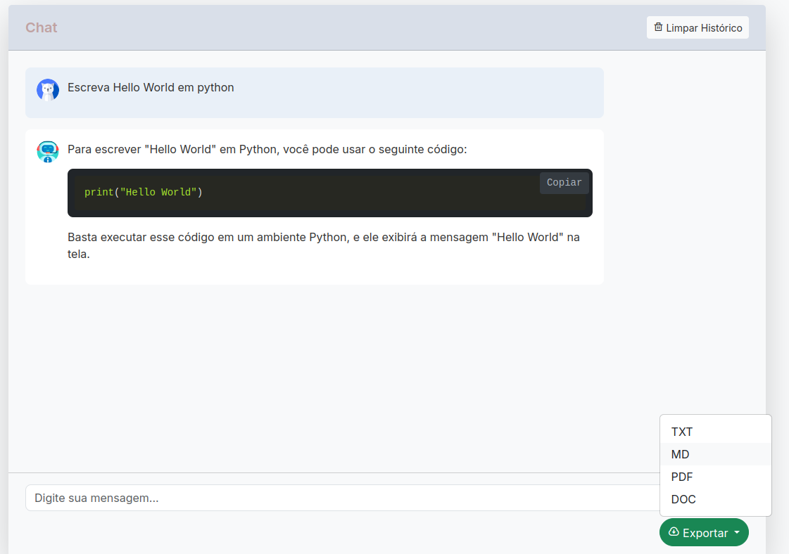
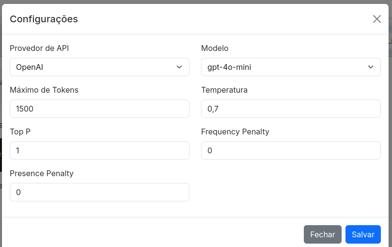

# WebChat 🤖

A powerful, modern, and flexible chat interface that integrates with multiple AI providers including OpenAI, Google's Gemini, and Perplexity AI.

[](https://www.python.org/)
[](https://flask.palletsprojects.com/)
[](https://getbootstrap.com/)



## ✨ Features

- 🔄 Multi-provider support (OpenAI, Gemini, Perplexity)
- 🎨 Clean and modern UI with Bootstrap 5
- 💬 Real-time streaming responses
- 🎯 Configurable AI parameters
- 📤 Multiple export formats (TXT, MD, PDF, DOC)
- 💾 Chat history management
- 🎨 Syntax highlighting for code blocks
- 📱 Responsive design for all devices

  




## 🚀 Getting Started

### Prerequisites

- Python 3.8+
- pip
- API keys for the services you want to use:
  - OpenAI
  - Google Gemini
  - Perplexity

### Installation

1. Clone the repository:

2. Install dependencies:
```bash
pip install -r requirements.txt
```

3. Create a `.env` file in the root directory and add your API keys:
```env
OPENAI_API_KEY=your_openai_key
GEMINI_API_KEY=your_gemini_key
PERPLEXITY_API_KEY=your_perplexity_key
```

4. Run the application:
```bash
python app.py
```

Visit `http://localhost:5000` in your browser to start using WebAssistent!

## 🛠️ Configuration Options

### AI Provider Settings

- **Model Selection**: Choose between different AI models from each provider
- **Temperature**: Control response creativity (0-1)
- **Max Tokens**: Set maximum response length
- **Top P**: Control response diversity
- **Frequency/Presence Penalties**: Fine-tune response patterns

### Interface Features

- **Dark/Light Mode**: Comfortable viewing in any lighting condition
- **Code Highlighting**: Automatic syntax highlighting for multiple languages
- **Markdown Support**: Rich text formatting in chat
- **Export Options**: Save conversations in various formats

## 🎯 Use Cases

- 💻 Code Generation and Debugging
- 📝 Content Creation
- 🤝 Customer Support Training
- 📚 Educational Assistance
- 🔍 Research Aid

## 🗂️ Project Structure

```
webassistent/
├── app.py              # Flask application & API routes
├── static/
│   ├── script.js       # Frontend JavaScript
│   └── style.css       # Custom styling
├── templates/
│   └── index.html      # Main application template
├── requirements.txt    # Python dependencies
└── .env               # Environment variables
```

## 🔒 Security Features

- Environment variable management for API keys
- CORS support
- Input validation and sanitization
- Secure response streaming
- Error handling and logging

## 🤝 Contributing

Contributions are welcome! Please feel free to submit a Pull Request. For major changes, please open an issue first to discuss what you would like to change.

## 📄 License

This project is licensed under the MIT License

## 🙏 Acknowledgments

- Backend powered by Flask
- Frontend styled with Bootstrap 5
- Code highlighting by highlight.js
- Markdown rendering by marked.js
- Icons by Remixicon

## 👨‍💻 Author

*Leo Gama*

- GitHub: [@LeoGamaJ](https://github.com/LeoGamaJ)
- Email: leo@leogama.cloud 
- LinkedIn: [Leonardo Gama Jardim](https://www.linkedin.com/in/leonardo-gama-jardim/)

---

⭐️ If you find this project useful, please consider giving it a star!

For additional information or support, please open an issue in the repository.
